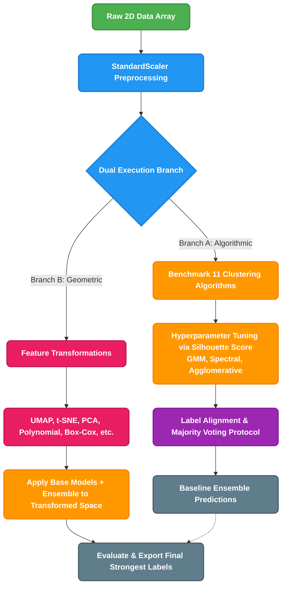

<div align="center">

# 🌌 Clustering Imbalanced Data: Feature Engineering & Transformation
**An advanced, end-to-end unsupervised learning pipeline designed to untangle complex, imbalanced spatial distributions.**

[](https://www.python.org/)
[](https://scikit-learn.org/)
[](https://jupyter.org/)
[](https://pandas.pydata.org/)

</div>

---

## 🎯 At a Glance (For Interviewers)
This repository demonstrates a **highly robust unsupervised learning architecture**. Unlike standard clustering tutorials, it tackles the hard problem of **imbalanced, non-spherical data distributions** through a dual-pronged approach:
1. **Algorithmic Ensembling:** Benchmarking 11 clustering algorithms, tuning the top 3 (GMM, Spectral, Agglomerative), and unifying them via an intelligent label-aligned **Majority Voting Protocol**.
2. **Manifold Feature Transformation:** Projecting the data into new geometric spaces (using techniques like *UMAP, t-SNE, PCA*, and *Polynomial Expansions*) to linearly separate previously intertwined spatial clusters before re-applying the models.

By isolating the impact of the algorithm vs. the impact of the feature space, this project provides a masterclass in modern data geometry and unsupervised decision boundaries.

---

## 🏗️ System Architecture

The following flowchart outlines the entire execution pipeline. We branch into evaluating the raw space with an ensemble of models, and subsequently transforming the manifold to discover hidden groupings.



---

## ⚙️ How It Works: The Pipeline

### 1️⃣ Data Loading & Exploratory Data Analysis (EDA)
The pipeline begins by ingesting the raw spatial dataset (`X`, `Y`) and applying `StandardScaler`. Initial visualizations reveal implicit, intertwined groupings that standard algorithms struggle to partition due to density variations and imbalance.

### 2️⃣ Base Model Benchmarking
Instead of guessing the right algorithm, the framework sweeps across **11 distinct clustering paradigms**:
* **Centroid-based:** K-Means, K-Medoids, Fuzzy C-Means
* **Density/Connectivity:** DBSCAN, OPTICS, Mean-Shift
* **Hierarchical:** Agglomerative Clustering, BIRCH
* **Distribution-based:** Gaussian Mixture Models (GMM)
* **Spectral & Topological:** Spectral Clustering, Self-Organizing Maps (SOM)

### 3️⃣ Refinement & Voting Ensemble
Based on the benchmarking phase, the top 3 most robust algorithms (**GMM, Agglomerative, and Spectral Clustering**) are selected.
* **Grid Search:** Parameters (`covariance_type`, `linkage`, `affinity`) are carefully tuned using the **Silhouette Score**.
* **Label Alignment:** Because unsupervised models assign random integer IDs (e.g., Cluster 0 in GMM might be Cluster 2 in Spectral), a custom alignment function actively maps these IDs to a shared consensus scale.
* **Majority Voting:** A standard `pd.DataFrame.mode()` mechanism calculates the most commonly predicted cluster for every single data point, significantly increasing out-of-sample robustness.

### 4️⃣ Advanced Feature Transformations & Dimensionalities
Can we change the data's geometry to make clustering easier? The notebook tests 11 structural space manipulations:
* **Mathematical:** Log, Exponential, Box-Cox (PowerTransformer).
* **Polynomial:** Degree-2 standard expansions and Feature Crosses.
* **Manifolds/Reductions:** PCA, Kernel PCA (RBF kernel), t-SNE, and UMAP.

### 5️⃣ Transformed Space Re-Evaluation 
The generated manifold spaces (UMAP, t-SNE, PCA, and Polynomial) are fed *back* into the clustering ensemble. Subplots actively map the transformed groupings back onto the origin space, graphically demonstrating how feature engineering impacts the ultimate decision boundary. 

---

## 🛠️ Technologies & Libraries Used

| Category | Libraries |
| -------- | --------- |
| **Core Processing** | `pandas`, `numpy` |
| **Visualization** | `matplotlib` |
| **Machine Learning** | `scikit-learn` *(KMeans, GMM, Agglomerative, Spectral, DBSCAN, OPTICS, etc.)* |
| **Specialized ML** | `sklearn-extra` *(KMedoids)*, `fcmeans` *(Fuzzy C-Means)*, `minisom` *(SOM)* |
| **Manifold Learning** | `umap-learn`, `scikit-learn` *(t-SNE, PCA)* |

---

## 🚀 Quick Start

### Prerequisites
Make sure you have Python 3.8+ installed. 

### Installation
Clone the repository and install the dependencies:
```bash
# Clone the repo
git clone https://github.com/your-username/Clustering-Imbalanced-data-Feature-Engineering-and-Feature-Transformation.git
cd Clustering-Imbalanced-data-Feature-Engineering-and-Feature-Transformation

# Create a virtual environment
python -m venv venv
source venv/bin/activate  # On Windows use: venv\Scripts\activate

# Install dependencies
pip install pandas numpy matplotlib scikit-learn scikit-learn-extra fuzzy-c-means minisom umap-learn
```

### Usage
Simply open the Jupyter Notebook and execute the cells sequentially:
```bash
jupyter notebook codes.ipynb
```
Follow the visualizations generated inline to see the transition from raw messy data to cleanly voting ensembles.

---
<div align="center">
<i>Built with insights from geometry, statistics, and ensemble logic.</i>
</div>
